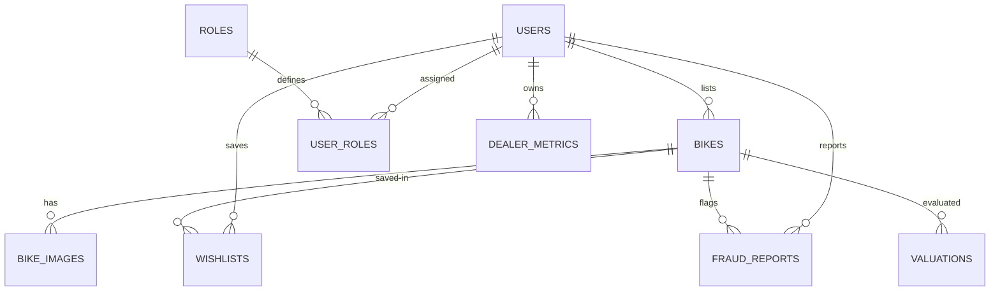

# BikeSense: Implementation Plan & Architectural Specification

BikeSense is an AI-powered used motorcycle marketplace focusing on price transparency, fraud mitigation, predictive valuation, and buyer-centric recommendations in the Sri Lankan market. This implementation plan establishes the architectural blueprint, API contracts, schema structures, ML framework, and the development roadmap.

---

## 1. Requirement Analysis

### 1.1 Context & Problem Statement
The second-hand motorcycle market in Sri Lanka operates with low transparency. Factors like localized pricing structures (Lakhs LKR), high variance in depreciation based on usage, odometer tampering, and advance-payment scams create risks for both buyers and sellers.
Existing platforms (general classified lists) act as bulletin boards without intelligence. BikeSense bridges this gap using Machine Learning and rule-based anomaly detection.

### 1.2 User Personas
- **Buyer**: Searches for reliable motorcycles, requires verification metrics, price evaluations, side-by-side matrices, and content recommendations.
- **Seller**: Lists individual vehicles, requests fair estimation price windows to avoid mispricing, and needs quick publication tools.
- **Dealer**: Professional entity requiring listing metrics, page views, active inventories, sales, and projected revenues.
- **Administrator**: Controls platform integrity, flags fraud alerts, investigates suspicious accounts/listings, and reviews database metrics.

---

## 2. Functional Requirements

*   **FR-1: Authentication & Profiles**: Register/Login via Local Credentials or Google OAuth. JWT token distribution. Profile management.
*   **FR-2: Listings Management**: Create, update, view, delete listings. Support high-resolution images, location parameters, and physical specs.
*   **FR-3: Active Document Vault**: Sellers can upload registration books (Doc-Vans), service books, and insurance copies for administrative verification.
*   **FR-4: AI Price Predictor**: Calculates fair listing values based on Brand, Model, Capacity, Year, Odometer mileage, Condition, Service history, Accidents, and Ownership count.
*   **FR-5: Fair Price Deal Gauge**: Visual classification of listed prices relative to predicted value (Good Deal / Fair Price / Overpriced).
*   **FR-6: Content-Based Recommender AI**: Scores listings based on buyer profiles (commute, travel, sport, budget constraints) using cosine-similarity concepts.
*   **FR-7: Fraud Diagnostic Scanner**: Scan attributes and descriptions for scams (unrealistic pricing, rollbacks, duplicate listings, payment requests).
*   **FR-8: Resale Value Projector**: Predict depreciated assets value for 1, 2, and 3 years ahead using compounding year-usage metrics.
*   **FR-9: Bike Health Allocator**: Calculates rating out of 100 representing mechanical condition.
*   **FR-10: Search, Advanced Filtering & Pagination**: Restrict listings by price, condition, mileage, location, engine, location, and verification badges.
*   **FR-11: Comparative Matrix**: Dynamic slot comparison (up to 3 models) showing specifications and best-bargain indicators.
*   **FR-12: Negotiator & Cost Advisor**: Suggests fair bargain points and calculates 3-year ownership metrics (fuel, maintenance, insurance, license).

---

## 3. Non-Functional Requirements

*   **NFR-1: Performance**: ML Prediction engine API response times under `500ms`. Page load latency < `2s`.
*   **NFR-2: Security**: Password hashing with BCrypt. JWT authentication with expiration (1 hour) and refresh keys. SSL communication. Rate limiting on authentication routes (5 requests/minute).
*   **NFR-3: User Experience**: Responsive layout supporting mobile, tablet, and desktop viewports. Glassmorphism styling with carbon dark mode base.
*   **NFR-4: Scalability**: System support for 10,000+ active listings, 20 concurrent ML processes, and 50 API requests per second.
*   **NFR-5: Search Engine Optimization**: Semantic HTML headings structure, meta description tags, and descriptive title tags for listings.

---

## 4. User Stories

```
+-----------------------------------------------------------------------------------------------+
| ID   | Role   | As a..., I want to...                            | So that I can...           |
|------+--------+--------------------------------------------------+----------------------------|
| US-1 | Seller | Input my bike specifications                     | Know its fair market value |
| US-2 | Buyer  | Filter out suspected fraudulent listings         | Search with trust          |
| US-3 | Buyer  | Compare three motorcycles side-by-side           | Pick the highest value deal|
| US-4 | Buyer  | Input my budget and usage profile                | Get custom AI suggestions  |
| US-5 | Dealer | Access a dashboard showing page views & sales    | Optimize catalog pricing   |
| US-6 | Admin  | Receive flags on duplicate phone listings        | Clean fake accounts        |
+-----------------------------------------------------------------------------------------------+
```

---

## 5. Use Cases

### 5.1 Use Case: Valuate Vehicle (Seller/Buyer)
- **Primary Actor**: Seller / Buyer.
- **Preconditions**: User navigates to AI Valuation Lab.
- **Main Flow**:
  1. Actor inputs Brand, Model, Year, Mileage, Engine CC, Condition, Service history, Accidents, and Ownership count.
  2. Actor clicks "🧬 Calculate Fair Value".
  3. System triggers backend API containing XGBoost model values.
  4. System renders: (a) Predicted Price (L|LKR), (b) Out of 100 Health Score, (c) 3-Year Depreciation curve, (d) Deal quality metrics.
- **Alternative Flow**: Missing core variables triggers validation toast.

### 5.2 Use Case: Fraud Diagnostic Check (Admin/System)
- **Primary Actor**: System / Administrator.
- **Flow**:
  1. User submits listing.
  2. Scanner scans price-to-predicted ratio, odometer checks, phone numbers, and title duplication.
  3. If anomalies exist, listing is flagged `isSuspicious = true` with reason list, and admin receives alert.

---

## 6. Database Design (Fully Normalized SQL Server Schema)



### SQL Database Creation Scripts
```sql
-- Create Users Table
CREATE TABLE Users (
    Id INT IDENTITY(1,1) PRIMARY KEY,
    FullName NVARCHAR(150) NOT NULL,
    Email NVARCHAR(150) UNIQUE NOT NULL,
    PasswordHash NVARCHAR(250) NULL,
    PhoneNumber NVARCHAR(20) NULL,
    IsGoogleUser BIT DEFAULT 0,
    IsVerified BIT DEFAULT 0,
    VerificationToken NVARCHAR(100) NULL,
    CreatedDate DATETIME DEFAULT GETDATE()
);

-- Create Roles
CREATE TABLE Roles (
    Id INT IDENTITY(1,1) PRIMARY KEY,
    Name NVARCHAR(50) UNIQUE NOT NULL
);

-- Create UserRoles Bridge
CREATE TABLE UserRoles (
    UserId INT FOREIGN KEY REFERENCES Users(Id) ON DELETE CASCADE,
    RoleId INT FOREIGN KEY REFERENCES Roles(Id) ON DELETE CASCADE,
    PRIMARY KEY (UserId, RoleId)
);

-- Create Bikes Table
CREATE TABLE Bikes (
    Id INT IDENTITY(1,1) PRIMARY KEY,
    Title NVARCHAR(200) NOT NULL,
    Brand NVARCHAR(100) NOT NULL,
    Model NVARCHAR(100) NOT NULL,
    Year INT NOT NULL,
    Mileage INT NOT NULL,
    EngineCC INT NOT NULL,
    FuelType NVARCHAR(50) NOT NULL,
    Transmission NVARCHAR(50) NOT NULL,
    Price DECIMAL(18,2) NOT NULL,
    Condition NVARCHAR(50) NOT NULL,
    OwnerCount INT DEFAULT 1,
    ServiceHistory NVARCHAR(50) NOT NULL,
    AccidentHistory NVARCHAR(50) NOT NULL,
    Description NVARCHAR(MAX) NULL,
    Location NVARCHAR(150) NOT NULL,
    SellerId INT FOREIGN KEY REFERENCES Users(Id) ON DELETE CASCADE,
    IsSuspicious BIT DEFAULT 0,
    CreatedDate DATETIME DEFAULT GETDATE()
);

-- Create Bike Images Table
CREATE TABLE BikeImages (
    Id INT IDENTITY(1,1) PRIMARY KEY,
    BikeId INT FOREIGN KEY REFERENCES Bikes(Id) ON DELETE CASCADE,
    ImageUrl NVARCHAR(2083) NOT NULL,
    IsPrimary BIT DEFAULT 0
);

-- Create Fraud Scans Reports
CREATE TABLE FraudReports (
    Id INT IDENTITY(1,1) PRIMARY KEY,
    BikeId INT FOREIGN KEY REFERENCES Bikes(Id) ON DELETE CASCADE,
    ReporterId INT NULL FOREIGN KEY REFERENCES Users(Id),
    Reason NVARCHAR(MAX) NOT NULL,
    Details NVARCHAR(500) NULL,
    CreatedDate DATETIME DEFAULT GETDATE()
);

-- Create Dealer Business Metrics Table
CREATE TABLE DealerMetrics (
    Id INT IDENTITY(1,1) PRIMARY KEY,
    DealerId INT UNIQUE FOREIGN KEY REFERENCES Users(Id) ON DELETE CASCADE,
    ViewsCount INT DEFAULT 0,
    SalesCount INT DEFAULT 0,
    TotalRevenue DECIMAL(18,2) DEFAULT 0.00
);
```

---

## 7. API Design (Contracts Spec)

### 7.1 Authentication Endpoints (`/api/auth`)
*   `POST /register`: Request JSON (`FullName, Email, Password`). Response 211 (`{ message: "Registration successful" }`).
*   `POST /login`: Request JSON (`Email, Password`). Response 200 (`{ token, refreshToken, role }`).
*   `POST /google`: Request JSON (`idToken`). Response 200 (`{ token, role }`).

### 7.2 Bikes Listings Endpoints (`/api/bikes`)
*   `GET /`: URL Params (`brand, type, maxPrice, isVerified, page, limit`). Response (`{ items: [], totalRecords }`).
*   `GET /{id}`: Returns spec sheet, predicted AI pricing, health, and resale details.
*   `POST /`: Admin/Seller listings creation. Request body (multipart form specification + files).
*   `DELETE /{id}`: Deletes checking seller authorization.

### 7.3 Valuations / AI Endpoints (`/api/valuation`)
*   `POST /valuate`: Inputs (`Brand, Model, Year, Mileage, Capacity, Condition, Owners, Services, Accidents`). Returns predicted price (LKR), health score out of 100, and 3-year depreciation estimates.
*   `POST /recommend`: Body (`budget, usageType, preferredBrand, mileagePriority`). Returns compatible matching arrays with score ratings.

---

## 8. System Architecture (Microservices Topology)

```
[ Angular Standalone SPA Dashboard Client ] (Frontend Interface)
         |
         v
[ API GATEWAY / REVERSE PROXY ] (Nginx/Render Routing)
         |
         +--------------------------+
         |                          |
         v                          v
[ ASP.NET Core Web API ]     [ Python FastAPI ML API ] (XGBoost Predictor)
(Business Core & EF Core)           |
         |                          v
         v                  [ joblib Model Registry ]
[ SQL Server Database ]
```

---

## 9. Folder Structure

```
+-- Bikesense (Workspace Root)
    +-- backend/ (ASP.NET Core API Net 8.0)
    |   +-- BikeSense.Core/ (Domain & Interface Contracts)
    |   +-- BikeSense.Infrastructure/ (Data Context & Repositories)
    |   +-- BikeSense.Api/ (Controllers, Program.cs, DB Migrations)
    +-- frontend/ (Angular Standalone Workspace)
    |   +-- src/
    |       +-- app/
    |           +-- components/ (Shared UI - layouts, bars)
    |           +-- features/ (tab modules: marketplace, compare, valuation)
    |           +-- services/ (bike-ml.service, api.service)
    +-- ml-service/ (Python REST Predictor API)
        +-- app.py (FastAPI entrypoint)
        +-- train.py (Aggregator training routines)
        +-- models/ (joblib serialized model artifacts)
```

---

## 10. UI/UX Plan Layout Blueprint

*   **Design Aesthetics**: Minimalist luxury dark carbon backgrounds (`#0B0F19`) overlaid with glassmorphism card properties (solid translucent drop filters). Highlight indicators represent neon cyan (`#06B6D4`) and deep violet (`#8B5CF6`).
*   **Hero Unit**: Modern automotive banner (Tesla layout) showcasing statistical features, pricing sliders, and valuation highlights.
*   **Empty State Visualizer**: Full-screen customized illustrations (not placeholders) when compare pools or search results contain blank indicators.

---

## 11. Machine Learning Architecture (FastAPI & Models)

```
[ Data Source: used-bikes.csv ]
              |
              v
[ Feature Engineering ]
- Price, Capacity, Mileage string parsing -> integers.
- LabelEncoder for Model & Seller.
- One-hot encoding for Bike Type & Brand.
              |
              v
[ Tree/Ensemble Comparisons ] -> Metric Evaluator MAE, RMSE, R²
- Linear Regression (Baseline)
- Decision Tree Regressor
- XGBoost Regressor (Primary Production)
              |
              v
[ Model Serialization ] (joblib dump) -> Exposed via FastAPI microservice
```

---

## 12. Development Roadmap Matrix

*   **Phase 1: Project Scaffolding & Setup** (1 week).
*   **Phase 2: Database Migration & Core Web API** (1 week).
*   **Phase 3: Python ML Predictor & Serialization** (1 week).
*   **Phase 4: Angular Standalone Front-end Dashboard** (1 week).
*   **Phase 5: Integrations & QA verification** (1 week).

---
*End of Specification Plan.*
